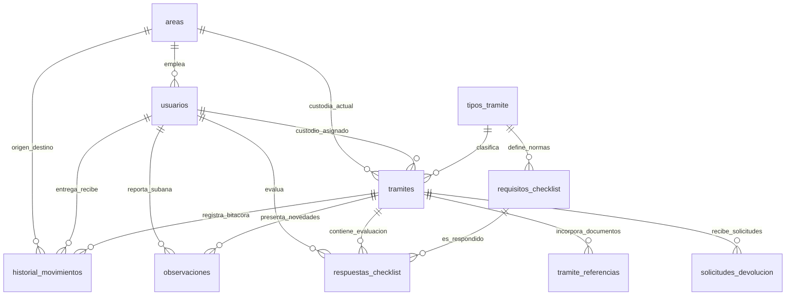

# SERVICIO NACIONAL DE ADUANA DEL ECUADOR (SENAE)
## DIRECCIÓN FINANCIERA · CONTROL PREVIO AL PAGO v2.0
### DICCIONARIO DE DATOS Y ESQUEMA DE BASE DE DATOS (POSTGRESQL 16)

---

### 1. DIAGRAMA ENTIDAD-RELACIÓN (ERD)

---

### 2. DICCIONARIO DETALLADO DE TABLAS Y CAMPOS

#### 2.1. TABLA: `tramites`
Entidad principal que almacena el expediente de pago y su estado a lo largo de todo el ciclo de vida.

| Campo | Tipo de Dato | Nulo | Descripción y Reglas de Negocio |
| :--- | :--- | :---: | :--- |
| `id_tramite` | `SERIAL PRIMARY KEY` | NO | Identificador único secuencial del expediente. |
| `codigo_tramite` | `VARCHAR(30) UNIQUE` | NO | Código institucional generado (ej. `TRM-2026-0001`). |
| `numero_quipux` | `VARCHAR(50) UNIQUE` | NO | Número oficial de memorando asignado en Quipux (ej. `SENAE-DFI-2026-0045-M`). |
| `fecha_memorando` | `DATE` | SÍ | Fecha consignada en el memorando Quipux. |
| `fecha_recepcion_fisica` | `DATE` | SÍ | Fecha exacta de ingreso físico de las fojas en ventanilla DFI. |
| `id_tipo_tramite` | `INTEGER FK` | NO | Enlace con el catálogo normativo de los 17 tipos de procesos. |
| `tipo_flujo` | `VARCHAR(50)` | NO | `PAGO` (con control de cuantía y devengado) o `EXPEDIENTE` (sin compromiso). |
| `proveedor_beneficiario` | `VARCHAR(200)` | NO | Razón social del contratista, funcionario o beneficiario del pago. |
| `ruc_proveedor` | `VARCHAR(13)` | SÍ | RUC o cédula de identidad validada contra algoritmo módulo 10/11. |
| `monto_total` | `DECIMAL(14,2)` | NO | Monto total legal del trámite. Si es >= $10.000 se marca como alta cuantía. |
| `es_alta_cuantia` | `BOOLEAN` | SÍ | `TRUE` si `monto_total >= 10000.00`. Requiere asignación a Jefatura de Presupuesto. |
| `numero_cur_compromiso` | `VARCHAR(30)` | SÍ | Número del CUR de Compromiso emitido por el área de Presupuesto. |
| `numero_cur_devengado` | `VARCHAR(30)` | SÍ | Número del CUR Devengado emitido en eSipren / Contabilidad. |
| `numero_cur_contable` | `VARCHAR(50)` | SÍ | CUR Contable exigido en devoluciones de garantías o anticipos. |
| `numero_factura` | `VARCHAR(60)` | SÍ | Número de Factura física autorizada por el SRI (formato `001-002-123456789`). |
| `fecha_factura` | `DATE` | SÍ | Fecha de emisión de la factura física. |
| `certificacion_presupuestaria` | `VARCHAR(60)` | SÍ | Número de certificación presupuestaria anual. |
| `item_presupuestario` | `VARCHAR(60)` | SÍ | Partida / Ítem presupuestario del clasificador fiscal. |
| `id_area_actual` | `INTEGER FK` | NO | Ubicación física y departamental actual del expediente (1 a 6). |
| `id_custodio_actual` | `INTEGER FK` | NO | Funcionario institucional legalmente responsable de la custodia actual. |
| `estado_general` | `VARCHAR(60)` | NO | Estado macro (`EN_RECEPCION`, `EN_PRESUPUESTO`, `EN_CONTABILIDAD`, `EN_AUTORIZACION_DFI`, `EN_TESORERIA`, `FINALIZADO_ARCHIVADO`, `DEVUELTO_FORMALMENTE`). |
| `sub_estado` | `VARCHAR(60)` | NO | Estado de detalle operativo institucional. |
| `esta_pausado` | `BOOLEAN` | SÍ | `TRUE` cuando el semáforo legal SLA se encuentra congelado (ej. falta de factura o devolución). |
| `motivo_pausa` | `VARCHAR(255)` | SÍ | Justificación legal por la cual se congela el SLA. |
| `fecha_pausa` | `TIMESTAMP(3)` | SÍ | Estampa temporal de inicio de la pausa. |
| `dias_pausa_acumulados` | `INTEGER` | SÍ | Contador de días calendario que el trámite estuvo legítimamente congelado. |
| `es_devuelto` | `BOOLEAN` | SÍ | Bandera de estado devuelto formalmente con memorando. |
| `motivo_devolucion` | `TEXT` | SÍ | Fundamento técnico y número de memorando de devolución. |
| `lote_mef` | `VARCHAR(50)` | SÍ | Número de lote enviado al Ministerio de Economía y Finanzas (MEF). |
| `spi_bce_referencia` | `VARCHAR(60)` | SÍ | Comprobante de transferencia interbancaria SPI del Banco Central del Ecuador. |
| `ubicacion_archivo` | `VARCHAR(120)` | SÍ | Ubicación topográfica física en Archivo Pasivo (Estantería / Balda / Tomo). |

---

#### 2.2. TABLA: `historial_movimientos` (Bitácora Forense Inmutable)
Registro de auditoría estricto para cumplimiento de normas de la Contraloría General del Estado.

| Campo | Tipo de Dato | Nulo | Descripción |
| :--- | :--- | :---: | :--- |
| `id_movimiento` | `SERIAL PRIMARY KEY` | NO | Identificador secuencial inmutable. |
| `id_tramite` | `INTEGER FK` | NO | Trámite al que pertenece el movimiento. |
| `id_usuario_entrega` | `INTEGER FK` | NO | Funcionario que despacha el expediente físico. |
| `id_usuario_recibe` | `INTEGER FK` | NO | Funcionario que recibe formalmente el expediente. |
| `id_area_origen` | `INTEGER FK` | NO | Departamento remitente. |
| `id_area_destino` | `INTEGER FK` | NO | Departamento destinatario. |
| `tipo_accion` | `VARCHAR(60)` | NO | Acción ejecutada (`RECEPCION_VENTANILLA`, `DERIVACION_A_PRESUPUESTO`, `MODIFICACION_DATOS_GENERALES`, `REINGRESO_POR_ALCANCE`, etc.). |
| `comentarios` | `TEXT` | SÍ | Detalle explicativo o diferencial forense de cambios (`[Monto: $500 -> $700]`). |
| `fecha_hora` | `TIMESTAMP(3)` | NO | Marca de tiempo estricta del servidor. |

---

#### 2.3. TABLA: `requisitos_checklist`
Catálogo oficial de los 137 requisitos normativos divididos por los 17 tipos de procesos SENAE.

| Campo | Tipo de Dato | Nulo | Descripción |
| :--- | :--- | :---: | :--- |
| `id_requisito` | `SERIAL PRIMARY KEY` | NO | Identificador único del requisito. |
| `id_tipo_tramite` | `INTEGER FK` | NO | Tipo de proceso asociado. |
| `fase` | `ENUM` | NO | `PRESUPUESTO` o `CONTABILIDAD`. |
| `descripcion` | `TEXT` | NO | Texto legal del documento requerido (ej. *"Acta de entrega recepción definitiva debidamente suscrita"*). |
| `orden` | `INTEGER` | SÍ | Posición secuencial en el formato de inspección. |
| `es_obligatorio` | `BOOLEAN` | SÍ | Si su incumplimiento impide la aprobación. |

---

#### 2.4. TABLA: `respuestas_checklist`
Evaluación interactiva y formal de cada requisito para un trámite particular.

| Campo | Tipo de Dato | Nulo | Descripción |
| :--- | :--- | :---: | :--- |
| `id_respuesta` | `SERIAL PRIMARY KEY` | NO | Identificador secuencial. |
| `id_tramite` | `INTEGER FK` | NO | Trámite evaluado. |
| `id_requisito` | `INTEGER FK` | NO | Requisito normativo auditado. |
| `estado_cumplimiento`| `ENUM` | NO | `CUMPLE`, `NO_CUMPLE`, `NO_APLICA`. |
| `observacion_especifica`| `VARCHAR(255)`| SÍ | Nota explicativa en caso de excepción o salvedad. |
| `id_usuario_evaluador`| `INTEGER FK` | NO | Analista que efectúa la verificación física. |
| `fecha_evaluacion` | `TIMESTAMP(3)` | NO | Fecha y hora de la verificación. |

---

#### 2.5. TABLA: `observaciones`
Registro de hallazgos preventivos con plazo legal de 72 horas para subsanación.

| Campo | Tipo de Dato | Nulo | Descripción |
| :--- | :--- | :---: | :--- |
| `id_observacion` | `SERIAL PRIMARY KEY` | NO | Identificador único. |
| `id_tramite` | `INTEGER FK` | NO | Trámite observado. |
| `id_area_reporta` | `INTEGER FK` | NO | Departamento que emite la observación preventiva. |
| `id_usuario_reporta`| `INTEGER FK` | NO | Funcionario auditor que detecta el vicio. |
| `detalle_observacion`| `TEXT` | NO | Descripción técnica de los documentos faltantes o inconsistencias. |
| `estado_observacion`| `VARCHAR(40)` | NO | `PENDIENTE` o `SUBSANADO`. |
| `respuesta_observacion`| `TEXT` | SÍ | Descargo o justificación emitida por el área observada. |
| `fecha_reporte` | `TIMESTAMP(3)` | NO | Inicio del plazo de 72 horas. |
| `fecha_resolucion` | `TIMESTAMP(3)` | SÍ | Cierre y subsanación formal. |

---

#### 2.6. TABLA: `tramite_referencias`
Gestión de documentos Quipux vinculados (Alcances, Devoluciones, Resoluciones).

| Campo | Tipo de Dato | Nulo | Descripción |
| :--- | :--- | :---: | :--- |
| `id_referencia` | `SERIAL PRIMARY KEY` | NO | Identificador único. |
| `id_tramite` | `INTEGER FK` | NO | Expediente vinculado. |
| `tipo_documento` | `VARCHAR(60)` | NO | `MEMORANDO_INICIAL`, `MEMORANDO_ALCANCE`, `MEMORANDO_DEVOLUCION`, `FACTURA_SRI`, `OTRO`. |
| `numero_documento`| `VARCHAR(100)` | NO | Código oficial del oficio o memorando. |
| `fecha_documento` | `DATE` | NO | Fecha estampada en el documento. |
| `asunto_sumilla` | `TEXT` | NO | Síntesis o sumilla del documento. |
| `id_usuario_registro`| `INTEGER FK` | NO | Usuario que registra la incorporación documental. |

---

#### 2.7. TABLA: `usuarios`
Cuentas de acceso institucional con credenciales y perfil funcional.

| Campo | Tipo de Dato | Nulo | Descripción |
| :--- | :--- | :---: | :--- |
| `id_usuario` | `SERIAL PRIMARY KEY` | NO | Identificador del servidor público. |
| `id_area` | `INTEGER FK` | NO | Departamento de adscripción. |
| `nombre_completo` | `VARCHAR(150)` | NO | Nombres y apellidos oficiales. |
| `correo_institucional`| `VARCHAR(100) UNIQUE`| NO | Correo oficial de dominio `@aduana.gob.ec`. |
| `cargo` | `VARCHAR(100)` | NO | Puesto en la estructura orgánica de SENAE. |
| `rol` | `ENUM` | NO | `DIRECTORA`, `SECRETARIA`, `JEFE`, `ANALISTA`, `ADMIN`. |
| `password_hash` | `VARCHAR(255)` | SÍ | Hash criptográfico de contraseña con salting institucional. |
| `activo` | `BOOLEAN` | NO | `TRUE` si el usuario está facultado para operar. |
| `estado_disponibilidad`| `ENUM` | NO | `DISPONIBLE`, `VACACIONES`, `PERMISO`, `INACTIVO`. |
